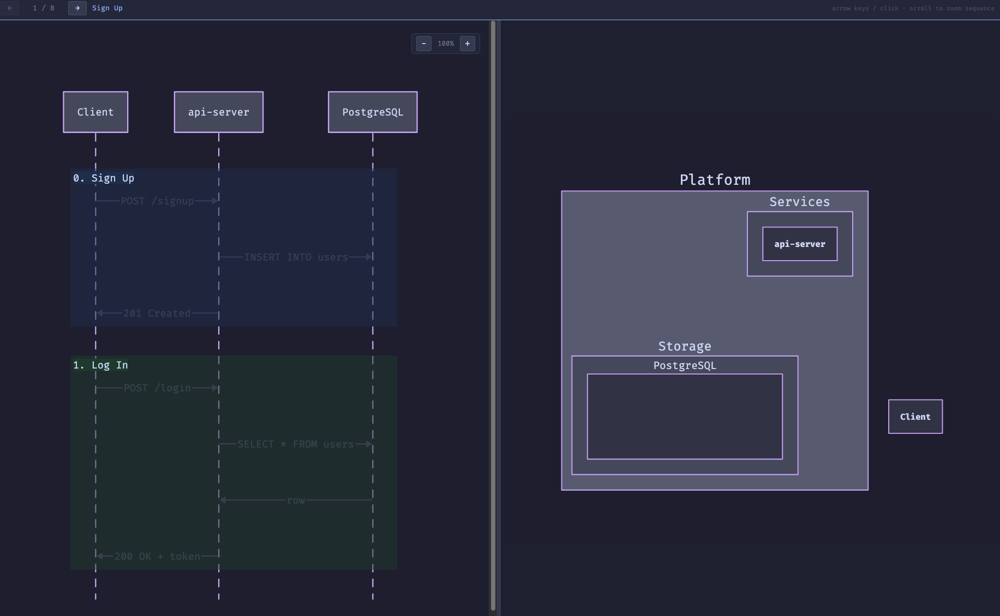

# Animated Architecture - a2

Interactive architecture diagrams. Define components and message flows in EDN, get a split-pane HTML viewer with a sequence diagram on the left and an architecture diagram on the right, stepping through in sync.

Uses [D2](https://d2lang.com) for diagram rendering.

[](https://htmlpreview.github.io/?https://github.com/socksy/a2/blob/main/examples/simple.html)

## Install

Download the latest archive for your platform from [Releases](https://github.com/benharri/a2/releases), extract it, and put both `a2` and `d2` somewhere on your PATH:

```
tar xzf a2-macos-arm64.tar.gz
sudo mv a2 d2 /usr/local/bin/
```

The archive contains the `a2` native binary and a bundled `d2` — no other dependencies needed.

### Development

To run from source, install [Babashka](https://babashka.org) and [D2](https://d2lang.com), then:

```
bb generate examples/simple.edn
```

## Usage

Each EDN input references a `:base` D2 file that defines the static architecture layout (containers, tables, styles). Edges are generated from your steps automatically.

```
a2 examples/simple.edn
```

Or with Babashka:

```
bb generate examples/simple.edn
```

## Input format

```clojure
{:base "base.d2"

 :nodes
 {:Client  "Client"
  :API     {:path "Platform.Services.API" :label "api-server"}
  :DB      {:path "Platform.Storage.DB"   :label "PostgreSQL"}
  :DB.apps "Platform.Storage.DB.apps"}

 :phases
 [{:color :blue  :title "Deploy"}
  {:color :green :title "Create Run"}]

 :steps
 [[{:from :Client :to :API :message "POST /apps/deploy"
    :set {:DB.apps {:id "abc123" :name "my-app"}}}
   {:from :API :to :DB :message "INSERT apps"}]

  [{:from :Client :to :API :message "POST /apps/runs"}]]}
```

Phases and steps are positional — steps at index 0 belong to phase 0. Nodes that appear in `:from`/`:to` become sequence diagram participants. The rest are path shortcuts for use in `:set`, `:lock`, etc. The `:base` D2 file defines the static architecture layout.

### Escaping

`$` in labels and cell values is escaped automatically (`$` → `\$`). Use `^:raw` metadata to skip escaping:

```clojure
{:from :Client :to :API :message "$100"}
{:from :Client :to :API :message ^:raw "${env.host}"}
```
